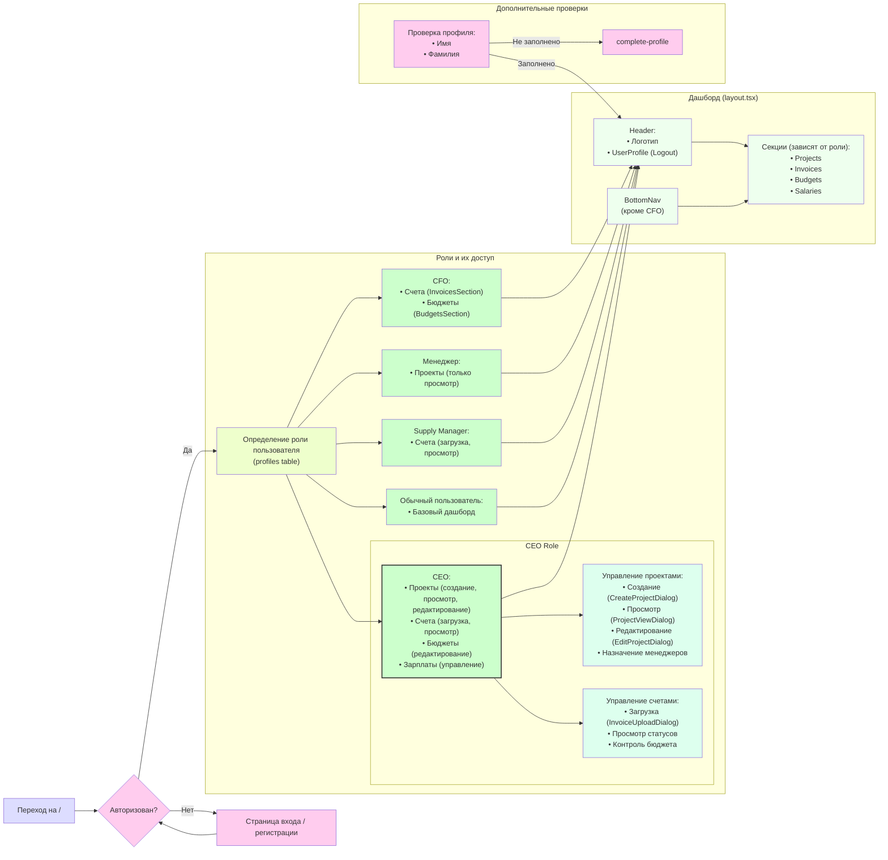

# EG App Structure Documentation

## Application Flow Diagram

## Описание структуры

### Основные потоки:

1. **Вход в систему**:
   - При переходе на главную страницу проверяется авторизация
   - Неавторизованные пользователи направляются на страницу входа/регистрации
   - После успешной авторизации определяется роль пользователя через таблицу profiles

2. **Роль CEO (основные возможности)**:
   - **Проекты**:
     * Создание новых проектов (CreateProjectDialog)
     * Просмотр и редактирование (ProjectViewDialog, EditProjectDialog)
     * Назначение/смена менеджеров проектов
     * Изменение статусов проектов
   - **Счета**:
     * Загрузка новых счетов (InvoiceUploadDialog)
     * Просмотр статусов и сумм
     * Контроль бюджета проекта
   - **Бюджеты**: управление через BudgetsSection
   - **Зарплаты**: управление через SalariesSection

3. **Интерфейс дашборда**:
   - Header с логотипом и UserProfile
   - BottomNav для всех ролей кроме CFO
   - Секции отображаются в зависимости от роли
   - По умолчанию для CEO показывается Projects

4. **Другие роли**:
   - CFO: доступ к счетам и бюджетам (без BottomNav)
   - Менеджер: только просмотр проектов
   - Supply Manager: работа со счетами
   - Обычный пользователь: базовый доступ

5. **Дополнительные проверки**:
   - Проверка заполненности профиля
   - Перенаправление на complete-profile при необходимости

### База данных и хранилище:
- Таблица profiles: хранение ролей и данных пользователей
- Таблица projects: проекты и их параметры
- Таблица invoices: счета и их статусы
- Storage: хранение файлов счетов 